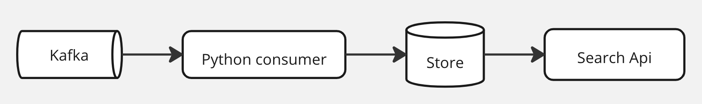

# Code review на техническом интервью

## Легенда

Ваш коллега предоставил на code review прототип online-поисковика по товарам, написанный для агрегатора
онлайн-магазинов.

## Краулер

В рамках прототипа, считываются описания товаров из kafka-топика. Каждое слово подаётся отдельным сообщением в нижнем
регистре. Например, описание `Компьютерное кресло с подлокотниками. Соответствует стандарту BIFMA.` в kafka-топике будет
последовательностью сообщений: `компьютерное`, `кресло`, `с`, `подлокотниками`, `соответствует`, `стандарту`, `bimfa`.
Прочитанные слова сохраняются в базу, а похожесть замеряется по n-граммному расстоянию.

## Движок запросов

Тут у нас простой веб-сервер. Он выдаёт топ-10 слов из сохранённых краулером. Слова в выдаче появляются в порядке
убывания похожести на запрошенное. Результат запроса не зависит от регистра запрошенного слова.

## Архитектура решения

